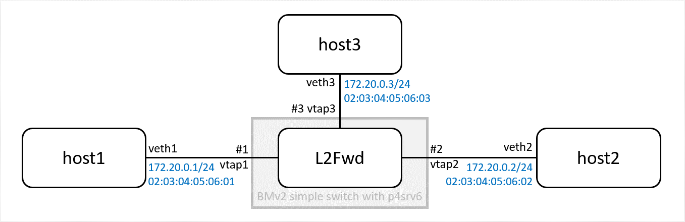

# L2Fwd (Flat L2 Switch, No VLAN support)

This page describes steps to reproduce a demo to confirm L2Fwd feature to forward packets based on MAC dstAddr.

No VLAN is configured. BMv2 will run as flat Layer 2 switch.



3 hosts with static IPv4 and MAC address are connected to single BMv2 switch.

## Planned Features

1. Static Table Entry **(done)**
2. Flooding of unlearned and broadcast packets
3. MAC learning with P4Runtime agent (set entry based on srcAddr)


## How to run demo

Configure netns, IPv4 and MAC address using script.

```
$ sudo ./ns-hosts-l2fwd.sh -c

Usage: ./ns-hosts-l2fwd.sh -{c|d} (c: create, d:delete)
Create 3 netns with tap interface visible to default ns as vtap1,2,3.
IPv4 and MAC address is statically configured for each veth.

 veth1: 172.20.0.1/24, 0203:0405:0601
 veth2: 172.20.0.2/24, 0203:0405:0602
 veth3: 172.20.0.3/24, 0203:0405:0603

 ns:host1   ns:host2   ns:host3
 +-------+  +-------+  +-------+
 | veth1 |  | veth2 |  | veth3 |
 +---+---+  +---+---+  +---+---+
     |          |          |
   vtap1      vtap2      vtap3
```

Run BMv2

```
~p4srv6$ sudo -s
simple_switch switch.json -i 1@vtap1 -i 2@vtap2 -i 3@vtap3 --nanolog \
ipc:///tmp/bm-0-log.ipc --log-console -L debug --notifications-addr \
ipc:///tmp/bmv2-0-notifications.ipc
```

### 1. Static Table Entry

Set static arp on all hosts.

```
$ sudo -s
ip netns exec host1 ip neighbor add 172.20.0.2 lladdr 02:03:04:05:06:02 dev veth1
ip netns exec host1 ip neighbor add 172.20.0.3 lladdr 02:03:04:05:06:03 dev veth1
ip netns exec host2 ip neighbor add 172.20.0.1 lladdr 02:03:04:05:06:01 dev veth2
ip netns exec host2 ip neighbor add 172.20.0.3 lladdr 02:03:04:05:06:03 dev veth2
ip netns exec host3 ip neighbor add 172.20.0.1 lladdr 02:03:04:05:06:01 dev veth3
ip netns exec host3 ip neighbor add 172.20.0.2 lladdr 02:03:04:05:06:02 dev veth3
ip netns exec host1 ip neighbor show
ip netns exec host2 ip neighbor show
ip netns exec host3 ip neighbor show
```

Run CLI and config table entries.

```
$ runtime_CLI.py
~$ ./p4/behavioral-model/tools/runtime_CLI.py
table_add dmac dmac_hit 0x020304050601 => 1
table_add dmac dmac_hit 0x020304050602 => 2
table_add dmac dmac_hit 0x020304050603 => 3
```

Ping from/to host1, host2 and host3.

```
# ip netns exec host1 ping 172.20.0.2 -c 2
PING 172.20.0.2 (172.20.0.2) 56(84) bytes of data.
64 bytes from 172.20.0.2: icmp_seq=1 ttl=64 time=3.91 ms
64 bytes from 172.20.0.2: icmp_seq=2 ttl=64 time=3.16 ms

# ip netns exec host2 ping 172.20.0.1 -c 2
PING 172.20.0.1 (172.20.0.1) 56(84) bytes of data.
64 bytes from 172.20.0.1: icmp_seq=1 ttl=64 time=3.66 ms
64 bytes from 172.20.0.1: icmp_seq=2 ttl=64 time=3.38 ms

# ip netns exec host3 ping 172.20.0.2 -c 2
PING 172.20.0.2 (172.20.0.2) 56(84) bytes of data.
64 bytes from 172.20.0.2: icmp_seq=1 ttl=64 time=3.16 ms
64 bytes from 172.20.0.2: icmp_seq=2 ttl=64 time=3.19 ms
```

