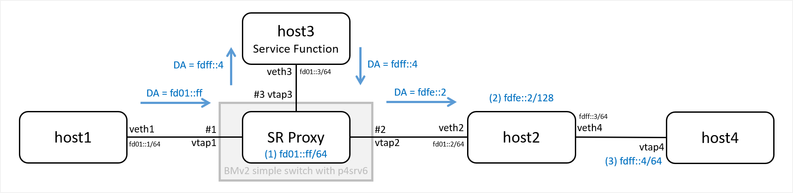
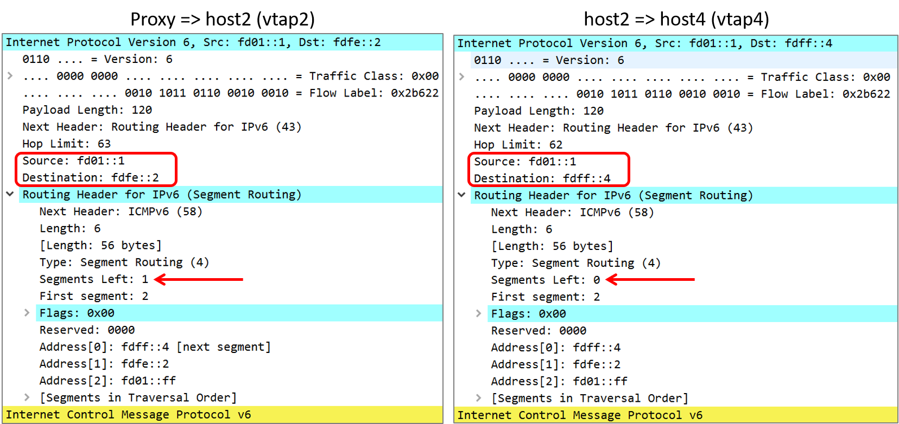

# End.AM ... How to test and packet dump examples.

This page describes how to test P4-16 implementation of `End.AM` based on [draft-xuclad-spring-sr-service-programming-02 | 6.4.1.  SRv6 masquerading proxy pseudocode](https://tools.ietf.org/html/draft-xuclad-spring-sr-service-programming-02#section-6.4.1)

Actions:

* end_am : Proxy => Service Function
* end_am_d : Proxy <= Service Function

Notes:

* Service Function will simply forward packet as is.
* end host (host4) would not respond due to limitation of how Linux (4.18.0-22-generic) handles packet with SRH.
* You can use PSP flavor of End function, which will pop SRH on host2, to test end to end pin6.
    * Linux Kernel implementation of PSP by Ryo Nakamura (@upa) can be found on below page.
    * [https://gist.github.com/upa/4a20638d7d7e3772e4ba6235c5d53fd4](https://gist.github.com/upa/4a20638d7d7e3772e4ba6235c5d53fd4)


## diagram & packet dump examples







## Compile P4 code for bmv2

```
~/p4srv6$ p4c --target bmv2 --arch v1model p4src/switch.p4
```

## Run p4srv6

create namespace and assign IP address, routes and sysctl.

```
~/p4srv6/demo/srv6/end.am$ sudo ./ns-hosts-srv6-end-am.sh -c
```

```
Usage: ./ns-hosts-srv6-end-am.sh -{c|d} (c: create, d:delete)
netns, veth: <IPv4>, <IPv6>
    host1, veth1: fd01::1/64
    host2, veth2: fd01::2/64
    host2, veth4: fdff::3/64
    host3, veth3: fd01::3/64
    default, vtap4: fdff::4/64
vtap:
    vtap1, vtap2, vtap3, vtap4

Create 4 netns with tap interface visible to default ns as vtap1/2/3/4.

 ns:host1   ns:host3   ns:host2          ns:host4
 +-------+  +-------+  +--------------+  +-------+
 | veth1 |  | veth3 |  | veth2  veth4 +--+ vtap4 |
 +---+---+  +---+---+  +---+------+---+  +-------+
     |          |          |
   vtap1      vtap3      vtap2

* checksum offloading disabled on all veth
* host3: route to fdff::/64 via fd01::2
* host4: route to fd01::/64 via fdff::3
* host3, host2: sysctl -w net.ipv6.conf.all.forwarding=1
```

Create iproute entry on host1 to insert SID List with 3 SIDs (fd01::ff, fdfe::2, fdff::4)
Create iproute entry on host2 to apply End function for fdff::2

```
> ip -6 route add <prefix> encap seg6 mode <encapmode> segs <segments> [hmac <keyid>] dev <device>
$ sudo -s
ip netns exec host1 ip -6 route add fdff::4/128 encap seg6 mode inline segs fd01::ff,fdfe::2 dev veth1
ip netns exec host2 ip -6 route add fdfe::2 encap seg6local action End dev veth4
```

Confirm routing table.

```
> ommitting fe80::/64 routes for simplicity.
# ip netns exec host1 ip -6 route
fd01::/64 dev veth1 proto kernel metric 256 pref medium
fdff::4  encap seg6 mode inline segs 3 [ fd01::ff fdfe::2 :: ] dev veth1 metric 1024 pref medium

# ip netns exec host2 ip -6 route
fd01::/64 dev veth2 proto kernel metric 256 pref medium
fdfe::2  encap seg6local action End dev veth4 metric 1024 pref medium
fdff::/64 dev veth4 proto kernel metric 256 pref medium

# ip netns exec host3 ip -6 route
fd01::/64 dev veth3 proto kernel metric 256 pref medium
fdff::/64 via fd01::2 dev veth3 metric 1024 pref medium
```


## Workaround configuration untill Layer 2 switching is supported

Add static MAC to host1, host3.

```
(sudo -s)
> MAC of fd01::ff can be any valid MAC since End.AM will modify MAC dstAddr.
ip netns exec host1 ip -6 neigh add fd01::ff lladdr 00:11:22:33:44:55 nud permanent dev veth1

> MAC of fd01::02 (host2) will change every time you create the interface.
> Copy MAC shown with `ip netns exec host2 ip a`
ip netns exec host3 ip -6 neigh add fd01::02 lladdr 52:58:79:fc:6b:9b nud permanent dev veth3

> Remove existing entry if `RTNETLINK answers: File exists` error was returned.
> ip netns exec host1 ip -6 neigh del fd01::ff dev veth1
```


## P4 Switch Table configuration

Run simple_switch under `~/p4srv6/`

```
$ sudo -s
simple_switch switch.json -i 1@vtap1 -i 2@vtap2 -i 3@vtap3 --nanolog \
ipc:///tmp/bm-0-log.ipc --log-console -L debug --notifications-addr \
ipc:///tmp/bmv2-0-notifications.ipc
```

Configure PortFwd table (workaround untill Layer 2 switching is supported)

```
$ runtime_CLI.py
~$ ./p4/behavioral-model/tools/runtime_CLI.py
table_add portfwd set_egress_port 1 => 2
table_add portfwd set_egress_port 2 => 1
```

Add Match/Action entry for End.AM to srv6_end table.

```
> ~$ ./p4/behavioral-model/tools/runtime_CLI.py
> action end_am(PortId_t oif, EthernetAddress dmac)
>   oif=3, dmac=<mac addr of veth3>, priority=100(required for ternary table)
> action end_am_d(PortId_t oif)
>   oif=2
$ runtime_CLI.py
table_add srv6_end end_am 0xfd0100000000000000000000000000ff&&&0xFFFFFFFFFFFFFFFFFFFFFFFFFFFFFFFF => 3 0x561f6aa0de06 100
table_add srv6_end_iif end_am_d 3 => 2
```

## Send and capture packets

Capture packets.

```
tcpdump -i vtap1 -w vtap1.pcap
tcpdump -i vtap3 -w vtap3.pcap
tcpdump -i vtap2 -w vtap2.pcap
ip netns exec host4 tcpdump -i vtap4 -w vtap4.pcap
```

Ping from host1(veth1 fd01::1) to host4 (vtap4 fdff::4)

```
ip netns exec host1 ping6 fdff::4
```

