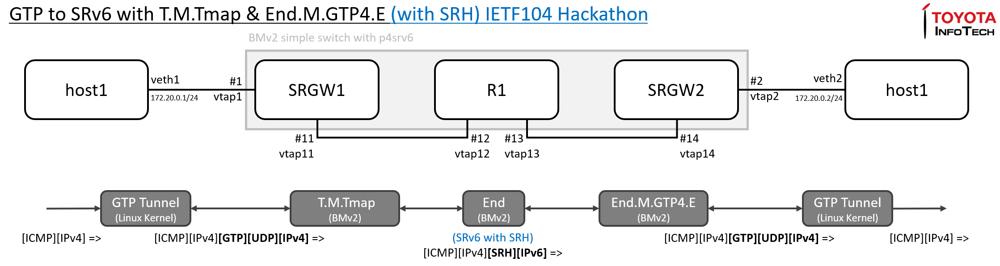

# IETF104 hackathon ... extending SRv6 Mobile Uplane

Extend below SRv6 Mobile Uplane functions defined in [draft-ietf-dmm-srv6-mobile-uplane-04](https://datatracker.ietf.org/doc/draft-ietf-dmm-srv6-mobile-uplane/04/) to use IPv6 SA in addition to Last SID to map more information from GTP to SRv6.

* T.M.Tmap
* End.M.GTP4.E

## Result

The test was conducted in below toplogy inside single VM using Software P4 Switch (BMv2).

Test procedure was exactly same as below using -04 version of the functions, except for table configuration due to introduction of new (experimental) functions, t_m_tmap_ietf104_sid1 and end_m_gtp4_e_ietf104 with parameters below.

[demo1 : How To run SRv6 Mobile Uplane POC (drop in replacement of GTP)](https://github.com/ebiken/p4srv6/blob/ietf104/demo/srv6/demo1-SRv6MobileUplane-dropin.md)

* Remote SRGW Prefix : 0xfc345678
* Local SRGW Src Prefix : 0xfd00000000000000

```
$ runtime_CLI.py
table_add srv6_transit_udp t_m_tmap_ietf104_sid1 2152 => 0xfc345678 0xfd00000000000000 0xfd010100000000000000000000000001
table_add srv6_end end 0xfd010100000000000000000000000001&&&0xFFFFFFFFFFFFFFFFFFFFFFFFFFFFFFFF => 100
table_add srv6_end end_m_gtp4_e_ietf104 0xfc345678000000000000000000000000&&&0xFFFFFFFF000000000000000000000000 => 100
```



Packets are captured at 4 vtaps:

* [ietf104-vtap1.trc](ietf104-vtap1.trc) : Ping over GTP-U/IPv4
* [ietf104-vtap11.trc](ietf104-vtap11.trc) : After T.M.Tmap (extended)
* [ietf104-vtap14.trc](ietf104-vtap14.trc) : After End
* [ietf104-vtap2.trc](ietf104-vtap2.trc) : After End.M.GTP4.E (extended)

## GTP/SRv6 Translation Logic

> Drawing by Satoru Matsushima :-)


