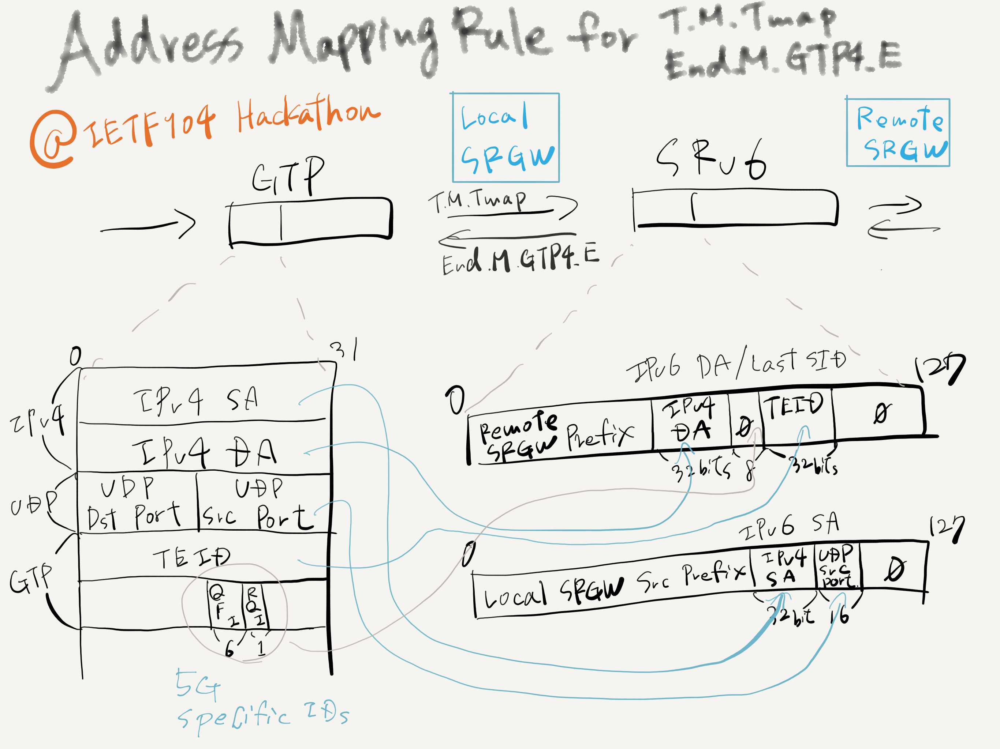

# IETF104 hackathon ... extending SRv6 Mobile Uplane

Extend below SRv6 Mobile Uplane functions defined in [draft-ietf-dmm-srv6-mobile-uplane-04](https://datatracker.ietf.org/doc/draft-ietf-dmm-srv6-mobile-uplane/04/) to use IPv6 SA in addition to Last SID to map more information from GTP to SRv6.

* T.M.Tmap
* End.M.GTP4.E

